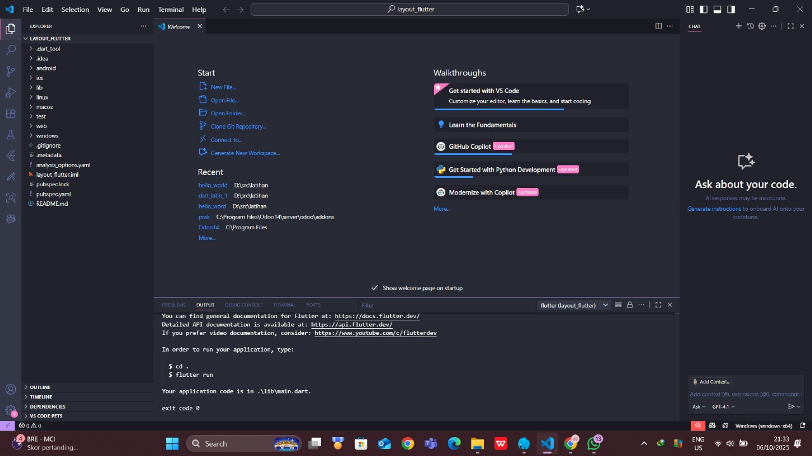
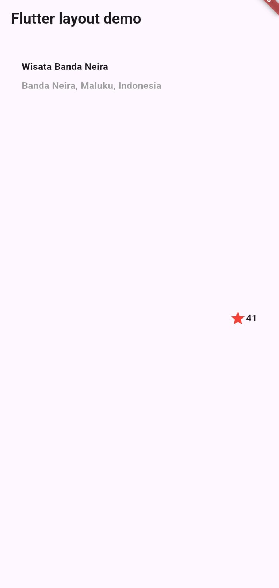
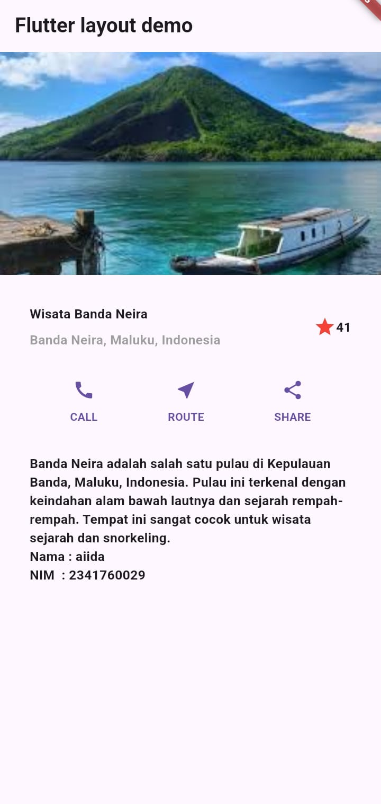

# layout_flutter

A new Flutter project.

## Getting Started

This project is a starting point for a Flutter application.

Membuat Project Baru

Hasil awal implementasi tittle row

Layout akhir berisi judul, lokasi, ikon bintang dengan rating, dan tiga tombol (CALL, ROUTE, SHARE) yang tersusun mendatar. Susunan elemen diatur menggunakan Column dan Row. Gambar di bagian atas dimuat melalui Image.asset dari folder images dengan path 'images/bandaneira.jpg', kemudian disesuaikan ukuran dan fit-nya agar tampak proporsional.